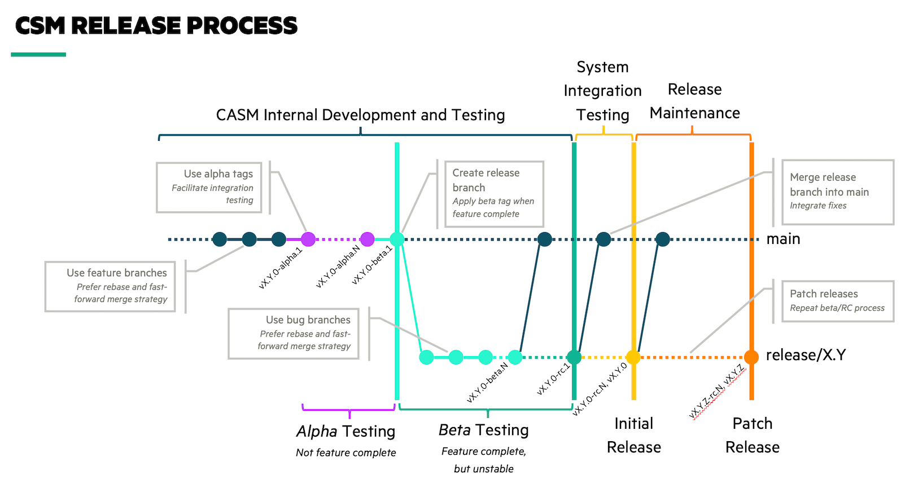

# Contributing to CSM

Welcome! This guide will help you understand how the CSM repository is
organized and how to update components included in a CSM release distribution.

- [Contributing to CSM](#contributing-to-csm)
  - [Getting Started](#getting-started)
  - [PIT and NCN Image Assets](#pit-and-ncn-image-assets)
  - [RPM Repository Indexes](#rpm-repository-indexes)
    - [RPM Index Format](#rpm-index-format)
  - [Loftsman Manifests and Docker and Helm Indexes](#loftsman-manifests-and-docker-and-helm-indexes)
    - [Docker Index Format](#docker-index-format)
    - [Helm Index Format](#helm-index-format)
  - [Vendored Repositories](#vendored-repositories)
  - [Git Workflow](#git-workflow)
    - [Version Tags](#version-tags)


## Getting Started

A CSM release distribution packages various assets together necessary for
installing or upgrading a Shasta system.

* LiveCD ISO
* NCN images
* RPM repositories (and RPMs)
* Container images
* Helm charts
* Loftsman manifests

In addition, CSM also vendors several repositories for convenience, primarily
to maintain parity.


## PIT and NCN Image Assets

The Pre-Install Toolkit (PIT) (a.k.a., LiveCD) and Non-Compute Node (NCN) image
assets are managed in `assets.sh`. The following Bash arrays list the asset
URLs for their respective component:

- `PIT_ASSETS` - Includes `.iso`, `.packages`, and `.verified` URLs for the
  LiveCD

- `KUBERNETES_ASSETS` - Includes `.squashfs`, `.kernel`, and `initrd` URLs for
  the Kubernetes NCN image

- `STORAGE_CEPH_ASSETS` - Includes `.squashfs`, `.kernel`, and `initrd` URLs
  for the Storage-Ceph NCN image

When sourced as part of another script (e.g., as in [release.sh]) or run
without any arguments (e.g., manual testing), `assets.sh` is expected to verify
all asset URLs are valid. It currently does this by sending an `HTTP HEAD`
request for each one using `curl -sfSLI`.


## RPM Repository Indexes

Repository `index.yaml` files are stored under the [rpm](rpm) directory. The
[release.sh] script currently creates the following repositories for
installation on customer systems:

- [CSM SLE 15sp1]
- [CSM SLE 15sp1-compute]
- [CSM SLE 15sp2]
- [Shasta Firmware] _(Deprecated in 1.5)_

Planned, but currently _unreleased_ repositories include:

- [CSM SLE 15sp2-compute]


### RPM Index Format

The RPM index format maps repository URLs to a list of RPMs. Optionally, the
`dir` attribute, which defaults to `.`, specifies a subdirectory into which the
specified `rpms` are organized.

```yaml
<repository-url>:
  [dir: <subdir>]
  rpms:
  - <rpm>
```

Please keep RPMs sorted lexicographically and organized according to upstream
repository.

Note that the repository URL references the RPM repository (i.e., the directory
containing `repodata/repomd.xml`), which is **not** (in most cases) the
directory containing the specified RPMs. Rather the repository metadata will be
examined in order to find the locations of the specified RPMs.


## Loftsman Manifests and Docker and Helm Indexes

Loftsman manifests reside in [manifests](manifests). When updating manifests,
ensure (as applicable):

- The [Docker index] and [Helm index] are updated

  - When adding a Helm chart, ensure it exists in the corresponding upstream
    repository (e.g., http://helmrepo.dev.cray.com:8080). Use the `helm3`
    client to search for the specific chart version:

    ```bash
    $ helm repo add cray-internal http://helmrepo.dev.cray.com:8080
    $ helm repo update
    $ helm search repo <chart> --version <version>
    ```

  - When adding a container image, ensure it exists in the corresponding
    upstream repository (e.g., https://dtr.dev.cray.com). Existence is easy to
    verify by using a client to pull or inspect the image locally.

    ```bash
    $ skopeo inspect docker://<image>:<tag>
    ```

  - When removing a container image, ensure no charts require it (note: more
    than one chart may use the image). Consequently, to make it simpler, it may
    be useful to add a comment to the index indicating which charts are
    dependent on _this_ image.

- [Customizations (in SHASTA-CFG/stable on master
  branch)](https://stash.us.cray.com/projects/SHASTA-CFG/repos/stable/browse/customizations.yaml)
  are updated as appropriate

  - Although charts are expected to have defaults values for a Shasta system,
    any value overrides that are common for _any_ Shasta system should go in
    the Loftsman manifest. Values in [customizations.yaml] are intended to be
    system-specific settings that a customer may need (or want) to change.


### Docker Index Format

The [Docker index] format is defined by the behavior of
`skopeo sync`'s `dir://` protocol. In general, it's simply a mapping of
registries to a list of image tags formatted as follows:

```yaml
<registry>:
  images:
    <repository>:
    - <tag>
```

Due to rate limits imposed by docker.io (and potentially other registries),
images are expected to come from https://dtr.dev.cray.com, with a few
exceptions. However, the [Docker index] still strives to keep images organized
based on the upstream registry they _actually_ come from. Notice that
`dtr.dev.cray.com` is listed first and the keys for other registries are
commented out. Please keep images sorted lexicographically and organized
according to upstream registry.


### Helm Index Format

The [Helm index] format resembles the [Docker index] format; however, it is
consumed by the custom `helm-sync` utility. It maps Helm repositories to lists
of specific chart versions.

```yaml
<repository>:
  charts:
    <name>:
    - <version>
```

Please keep charts sorted lexicographically and organized according to upstream
repository.


## Vendored Repositories

The following Git repositories are vendored (using [git vendor]) into the
CSM repository:

- `release` references [SHASTARELM/release] - Shared tooling for generating
  releases and facilitating installation. Vendor `master` branch:

  ```bash
  $ git vendor update release master
  ```

- `shasta-cfg` references [SHASTA-CFG/stable] - Default chart customizations
  and sealed secrets. Vendor `master` branch:

  ```bash
  $ git vendor update shasta-cfg master
  ```

- `docs-csm-install` references [CSM/docs-csm-install] - CSM documentation

  Since the `docs-csm-install` RPM is part of [CSM SLE 15sp2], then the
  vendored commit ID should reference the same commit ID from the RPM. For
  example, consider:

  ```bash
  $ cat rpm/cray/csm/sle-15sp2/index.yaml | docker run --rm -i mikefarah/yq:4 e '.. | select(. == "docs-csm-install-*")' -
  docs-csm-install-1.7.15-20210311085010_a4626db.noarch
  ```

  This indicates the `docs-csm-install` RPM is at commit `a4626db`. Therefore
  the vendored reference should be against commit
  `a4626dbe9983abf76a4753df50e52a50e321f463`. (Note that the vendored reference
  has to use the full commit ID.)

  ```bash
  $ git vendor update docs-csm-install a4626dbe9983abf76a4753df50e52a50e321f463
  ```

  Although `docs-csm-install` should vendor against a specific commit ID, it is
  expected that the following CSM mainlines track specific `docs-csm-install`
  branches as follows:

  - `main` should vendor `docs-csm-install@release/shasta-1.5`
  - `release/0.9` should vendor `docs-csm-install@release/shasta-1.4`


## Git Workflow

The CSM repository has the following mainline branches:

- `main` - Tracks development of the _next_ CSM release
- `release/X.Y` - Release branches track the lifespan of a specific _X.Y_ release



By default, pull requests against release branches will be [automatically
merged] to downstream release branches ending with `main`. Bugfix PRs should
target the oldest pertinent release branch such that changes may be
automatically merged downstream. Do not worry, in the event of a conflict Stash
will automatically create another PR against the impacted branch to be manually
resolved.

Use feature branches named after the corresponding JIRA issue(s) (e.g.,
`CASMINST-123`) to develop enhancements and fixes. PRs will be approved and
merged according to the [CASM release process] (see also the [CASM release
dashboard]).

A _good_ pull request will provide, as appropriate:

- Descriptive title, prefixed with JIRA issue
- Concise, yet meaningful, summary of changes
  - PR title may be sufficient for simple changes
  - Enumerating version updates of specific assets is NOT sufficient
- Listing of resolved, related, or otherwise impacted JIRA issues
- Information pertaining to related pull requests (e.g., "merge after" instructions)
- Details about how changes were tested and verified


### Version Tags

Tags prefixed with `v` are used to indicate a commit corresponds to a specific
CSM version. Tags on a `release/X.Y` branch *must* begin with `vX.Y`; however,
`main` may also be tagged, typically with `-alpha.N` pre-release versions.

Be aware that the build pipeline is triggered by version tags, which will
result in a new release distribution being built and uploaded to Artifactory.

Version tags imply specific meaning. The following conventions *must be* used
as appropriate:

- `vX.Y.Z-alpha.N` - The _Nth_ non-feature complete pre-release of version
  _X.Y.Z_

- `vX.Y.Z-beta.N` - The _Nth_ feature complete but unstable pre-release of
  version _X.Y.Z_

- `vX.Y.Z-rc.N` - The _Nth_ feature complete and stable pre-release of version
  _X.Y.Z_; a _release candidate_

- `vX.Y.Z` - Version _X.Y.Z_; may reference the same commit as the last
  release candidate


[release.sh]: release.sh
[CSM SLE 15sp1]: rpm/cray/csm/sle-15sp1/index.yaml
[CSM SLE 15sp1-compute]: rpm/cray/csm/sle-15sp2-compute/index.yaml
[CSM SLE 15sp2]: rpm/cray/csm/sle-15sp2/index.yaml
[CSM SLE 15sp2-compute]: rpm/cray/csm/sle-15sp1-compute/index.yaml
[Shasta Firmware]: rpm/shasta-firmware/index.yaml
[customizations.yaml]: https://stash.us.cray.com/projects/SHASTA-CFG/repos/stable/browse/customizations.yaml
[Docker index]: docker/index.yaml
[Helm index]: helm/index.yaml
[git vendor]: https://github.com/brettlangdon/git-vendor
[SHASTARELM/release]: https://stash.us.cray.com/projects/SHASTARELM/repos/release/browse
[SHASTA-CFG/stable]: https://stash.us.cray.com/projects/SHASTA-CFG/repos/stable/browse
[CSM/docs-csm-install]: https://stash.us.cray.com/projects/MTL/repos/docs-csm-install/browse
[automatically merged]: https://confluence.atlassian.com/bitbucketserver/automatic-branch-merging-776639993.html#Automaticbranchmerging-ordering
[CASM release process]: https://connect.us.cray.com/confluence/display/CASM/CASM+Merge+and+Release+Process
[CASM release dashboard]: https://connect.us.cray.com/confluence/display/CASM/CASM+Release+Progress+Dashboard
[CHANGELOG.md]: CHANGELOG.md
